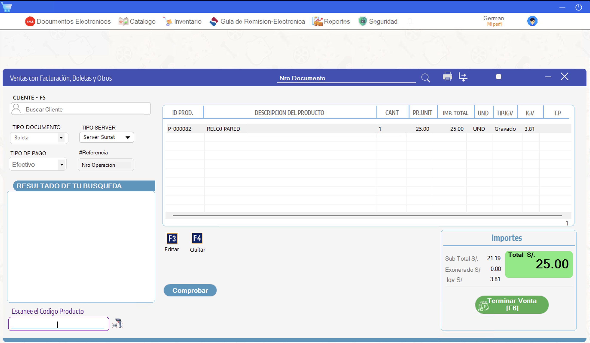
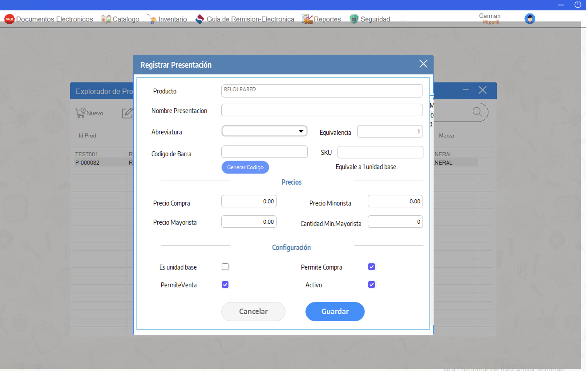
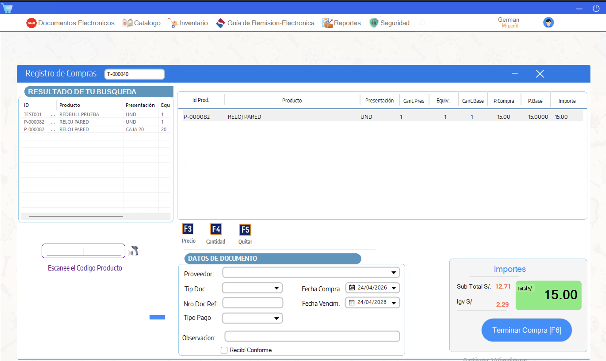

# Sistema de Ventas WinForms

Sistema POS desarrollado en C# Windows Forms y SQL Server para la gestión de ventas, compras, inventario, caja y facturación electrónica.

## Tecnologías

- C#
- Windows Forms
- .NET Framework
- SQL Server
- Arquitectura por capas
- Facturación Electrónica SUNAT
- XML / Firma digital
- Crystal Reports

## Módulos principales

- Ventas POS
- Compras
- Inventario
- Clientes
- Caja
- Kardex
- Reportes
- Facturación electrónica
- Generación de XML
- Envío de comprobantes electrónicos

## Arquitectura

El sistema está organizado bajo una arquitectura por capas:

- `Prj_Capa_Entidad`
- `Prj_Capa_Datos`
- `Prj_Capa_Negocio`
- `Microsell_Lite`
- `CreacionXml`
- `CPEEnvio`
- `Signature`

## Capturas

### Sistema POS

### Ventas - Facturación Electrónica

### Inventario

### Compras

## Nota

Este repositorio corresponde a una versión demostrativa del sistema.  
No incluye credenciales, certificados, datos reales de clientes ni configuraciones sensibles.
